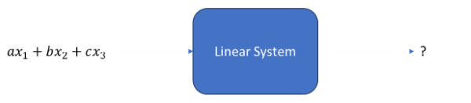

# CSE 3313 - Homework #2 - Discrete linear Shift-Invariant Systems
- Name: Landon Moon
- ID: 1001906270

## <u>LINEARITY</u>

1.  - Q: We know that putting x1 into a linear system results in the output y1; putting x2 into the system results in the output y2; and putting x3 into the system results in the output y3. What is the output of that linear system with the input below?

        

    - A: <u>ay1 + by2 + cy3</u>

2. Test the following systems for **linearity** using the test procedure given in class and determine whether they ar elinear or non-linear.

    a. 

    b. 

    c.

## <u>SHIFT-INVARIANCE</u>

3. 

4. 

## <u>LINEAR SHIFT-INVARIENT SYSTEMS</u>

5. 

6. 

7. 

8. 

9. 

10.
