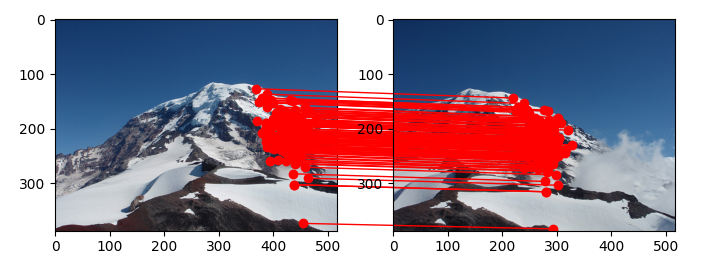

# Assignment 2
- Name: Landon Moon
- ID: 1001906270

## Overview
There are three parts of this assignment: Keypoint Matching, Evaluating Keypoint Detectors, and Image Stitching.

As a note to the professor, I dont like to play CodeDebugSimulator. Having each part of the assignment essentially be to read through your code, copy-paste, clean up & debug, then implement the actual assignment is very annoying and tedious. 90% of my time on this assignment was spend molding your code into a form fit for this assignment. It would be much better if you gave explicit codefiles that have TODO statments where the students need to work.

## Required libraries

Because the boilerplate code is from the professors code, much of the dependencies transfer over. some include:
- sklearn
- skimage
- matplotlib
- tqdm
- numpy

### Keypoint Matching

The related code files are:
- keypoint_detectors/keypoint_matching.py

As stated by the professor, I imlpemented a brute-force function to match keypoints between two images. my implementation of match_descriptors closely matches the one provided by skimage.feature.match_descriptors. There is a small difference in matched keypoint; this is most likely due to my function not considering ties when eliminating pairs while cross checking. Other parts of the code are generally taken from the professor's github and cleaned up for my coding style.

The code is designed to expect two filenames from the command line. These are the two images that are used to match keypoints between.

### Evaluating Keypoint Detectors

The related code files are:
- keypoint_detectors/feature_extraction.py
- keypoint_detectors/evaluate_hog.py
- keypoint_detectors/evaluate_sift.py
- keypoint_detectors/load_and_split.py

#### Keypoint Detectors Report

1. the number of features extracted using each approach
  - After extracting features from the dataset, SIFT was able to extract 310,568 individual features from 20000 images. That averages to about 16 features per image.
  - As the hog feature vector is always the same length (324 with default settings), I counted each as 1 so 20000 'features' were extracted from 20000 images. I could do some thresholding on the hog feature vector provided by skimage but that seems tedious and not too useful.
2. the number of correct matches found
  - After running evaluate_sift.py, there were a total of 1049 matches on the test dataset of 4000.
  - After running evaluate_hog.py, there were a total of 1417 matches on the test dataset of 4000.
3. the accuracy of the classifiers when evaluated on the test set
  - The total accuracy using SIFT was 0.26 which matches with the professors example
  - The total accuracy using HOG was 0.35

### Image Stitching

The related code files are:
- image_stitching/stitch_images.py

Works the same as the professors sample code but with the three implemented functions. The file has a readme with more details.

#### Brief report

Affine Transform Picures

Projective Transform Example

Overall It looks like the projective transform is able to match with more points. This is primarily due to the the projective transform being able to warp the points in more ways. There are a couple cases where the affine transform looks a bit more off than it should be while the projective transform handles those cases better. Specifically the rainier affine vs projective case. The affine transform doesn't line up as well. (it might be able to if I crank up the number of iterations)

