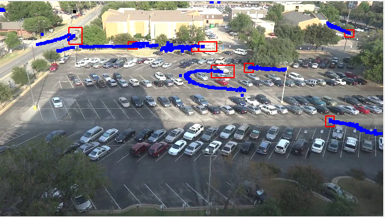

# Assignment 3
- Landon Moon
- 1001906270

## Execution instructions
As stated in the assignment description I started with the qtdemo code. This means that pyside2 is required along with its dependency of ffmpeg and python 3.10 or lower. Other than that the only dependencies are scikit-image and scikit-video.

The executable is: qtvideo.py

The GUI will show some extra information that is extracted from the video. Red boxes are candidates. Black dots are inactive candidates. Blue dots/lines are active tracked objects.

## Notes on Implementation
I am assuming that 'frames_to_skip' implies an iterative solution to update up to a given frame. When I implemented this it can be fairly slow if it is updating every frame. I should optimize it.

I might be slightly off with my update function. I relied on my physics background to determine the 'control matrix' but didn't explictly separate the update equation. The approach I took was based on derivitives of position (velocity and acceleration). From there I have the predicted state and the implied state from the update, instead of a predicted state and a update vector to the observed position. I would have to subtract the implied state from the predicted state, and well, thats just an extra unneeded step.

Lastly I noticed some downfalls of the assignments implementation and tried to fix it where I can. The primary downfall is due to candidates grouping together and causing the candidate's centroid to quickly move. This causes problems with acceleration because it can become very large over a single update. To fix this I commented out the acceleration update portion and replaced it with 0. Additionally due to position and velocity being effected as well, I implemented an alpha factor between the predicted state and the true updated state. This gives a hyperparameter that represents how much an update 'trusts' a match. This gave significantly better results from my testing.

## Example

### Hyperparameters
- frame_hysteresis=16
- motion_threshold=10
- distance_threshold=20
- frames_to_skip=4
- max_objects=100
- blob_size=4
- alpha=0.5 described in section above. Change if KalmanFilter.py if desired