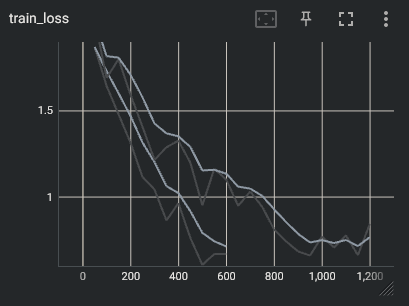
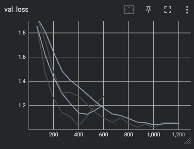
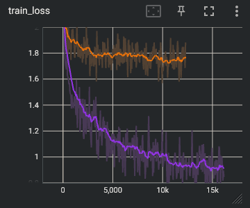
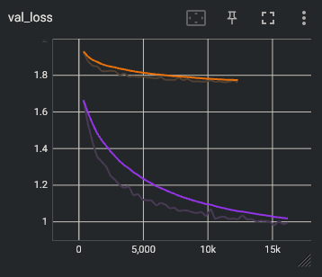

# Assignment 4 Report

saving and loading of model weights should be done as such:
- Save:
torch.save(model.state_dict(), PATH)
- Load:
model = Model()
model.load_state_dict(torch.load(PATH))

model weights are saves as file in /model_weights/

I probably could have reduced code duplication between files but senioritis is kicking is so sorry.

## Basic CNN

implemented in basic_cnn.py

I initally messed around with emulating the VGG-19 model but got abismally bad results. I belive it has something to do with the difference in image sizes and number of output classes. Additially, most of my own more complex ideas also gave similarly bad results (~10% acc, same as random guess). I implemented a decent all_conv first and decided to copy the same idea I had for the convolutional section.

As stated above, I messed around with a couple more complex models but didn't get good results. I eventually landed on a more simple model that follows the idea of the all_conv code (look below). The convolutional section starts with many channels and slowly reduces the number of channels until the fully connected NN can make some sense of it. The fully connected NN I implemented is again fairly basic. It contains two hidden layers with 512 and 128 nodes respectively.

- Training Loss:   0.8066
- Validation Loss: 1.317
- Test accuracy:   0.4525

## All Convolutional Net

Implemented in all_conv.py

I made a simple archetecture of my own. The idea is to combine convolutions that represent small/basic components into larger/more meaningfull components. The model starts out with a large number of channels that can represent a large amount of basic features, then reduces the channels to increase the meaningfulness of each channel. The initial convolutions might be able to reconize common edges/corners in a type of image, then later covolutions (after pooling) can reconize these basic attributes and possibly group them together to form an idea of object types.

The archetecture starts with a convolution step with 512 channels and max pools it; then 256, 128, 64, 32. It does this until 32. The final result is an image that is 2x2 with 32 channels. To convert this to the given number of classes, the model does a simple estimator with no hidden layers. It is comprized of one linear transformation from (2*2*32) to the given number of classes

- Training Loss:   0.6696
- Validation Loss: 1.276
- Test accuracy:   0.6431

## Regularization

Implemented in all_conv_reg.py

For regularization I implemented both dropout and data augmentation. In terms of final test accuracy, there is a slight improvement but not by much. The largest difference is that the model with dropout and trained on a data-augmented dataset took longer to start overfiting. The valication loss took longer to start increasing and started increasing at a lower rate. The final validation loss was also lower for the regularized model due regularization slowing down overfitting.

- Training Loss:   0.8444
- Validation Loss: 1.052
- Test accuracy:   0.6721

## Transfer Learning

Implemented in all_conv_trans.py

from scratch comparison is in all_conv_reg_cifar10.py

I chose to use the regularized all convolution model. The model starts with many convolutional channels to 'understand' basic features and slowly reduces the number of channels and img size to group the basic features into larger features. Additionally regularization in the form of dropout and data augmentation is done to reduce overfitting.

While the accuracy of the model with the transfered features performed worse than the model that was trained from scratch, it trained much faster. The from-scratch model took ~4 hours to finish while the transfer learned model took ~15 minutes. This is due to only needing to train a single classifier instead of a classifier and many layers of a convolutional net.

### from-scratch comparison
- Training Loss:   0.6466
- Validation Loss: 0.9955
- Test accuracy:   0.8471

### tranfer learning
- Training Loss:   1.882
- Validation Loss: 1.762
- Test accuracy:   0.3762
